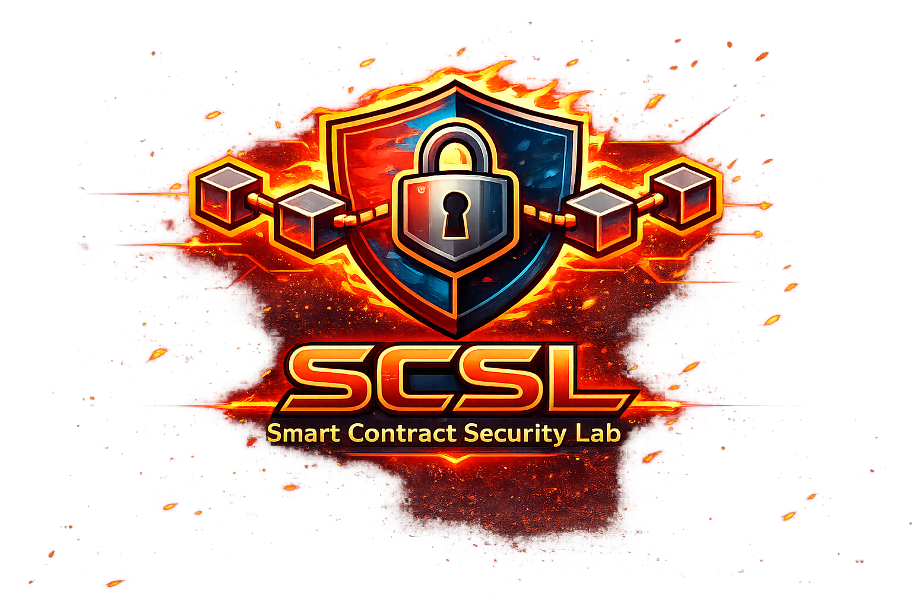

<p align="center">
  
</p>

# SCSL

## Smart-Contract Security Lab

SCSL is an educational and practical Solidity security repository built to teach developers how vulnerabilities actually happen, how attackers exploit them, and how to fix them using production-minded patterns.

This project is intentionally split into two major areas:

- `examples/`: the educational encyclopedia of vulnerabilities, exploit flows, secure rewrites, and test cases.
- `library/`: the reusable Solidity security primitives that will be designed for direct integration into real projects.

The philosophy of the repository is simple:

> To secure smart contracts, you must first learn how to break them.

SCSL is designed for:

- junior Solidity developers who want to build security intuition early
- mid-level Web3 engineers moving toward auditing and protocol security
- hackathon teams that need fast, practical security references
- educators and self-learners who want exploit-driven explanations instead of shallow examples

## Repository Architecture

```text
/library
/examples
/public
README.md
LICENSE
package.json
hardhat.config.ts
tsconfig.json
.gitignore
```

## What To Push To GitHub

For a real GitHub repository, you should keep not only the top-level content folders, but also the project metadata and tooling files that make the repository reproducible.

Recommended to commit:

- `library/`
- `examples/`
- `public/`
- `README.md`
- `LICENSE`
- `package.json`
- `package-lock.json`
- `hardhat.config.ts`
- `tsconfig.json`
- `.gitignore`

Do not commit:

- `.env`
- `node_modules/`
- `artifacts/`
- `cache/`
- `coverage/`

Right now, because the library is still under active development, it is also reasonable to keep the temporary development-only layers in the repository:

- `library/mocks/`
- `library/test/`

Later, when the reusable package surface is finalized, those temporary files can be removed from the published library layer.

## What Lives In `examples`

Each vulnerability module is a full educational unit with:

- a long-form topic guide in English
- `Vulnerable.sol`
- `Attack.sol`
- `Fixed.sol`
- exploit tests
- fix validation tests

These modules are designed to feel like real audit case studies rather than toy snippets.

Every module is meant to answer four questions clearly:

- what the vulnerability is
- why it exists at the EVM and protocol-design level
- how an attacker actually abuses it
- how to redesign the system so the class of bug becomes harder to reintroduce

## What Lives In `library`

The `library/` directory is reserved for reusable security patterns and helper contracts, such as:

- reentrancy guards
- pull-payment primitives
- two-step ownership helpers
- signature validation helpers
- storage-safe proxy helpers
- secure accounting utilities

This layer is intended to become the package-quality part of SCSL.

The long-term direction is to make `library/` suitable for packaging and reuse, while `examples/` remains the open educational knowledge base of the project.

## Current Example Modules

- `reentrancy`
- `access-control`
- `dos`
- `integer-overflow-underflow`
- `delegatecall`
- `signature-replay`
- `timestamp-manipulation`
- `front-running-mev`
- `flash-loans`
- `storage-collisions`

## Development

Install dependencies:

```bash
npm install
```

Run all example tests:

```bash
npx hardhat test
```

Compile all example contracts:

```bash
npx hardhat compile
```

Run only the library development tests:

```bash
npm run test:library
```

## Notes

- All educational documentation and code comments are written in English.
- The repository conversation and collaboration can still happen in Russian.
- Example tests are grouped by vulnerability module to keep the project scalable as more modules are added.
