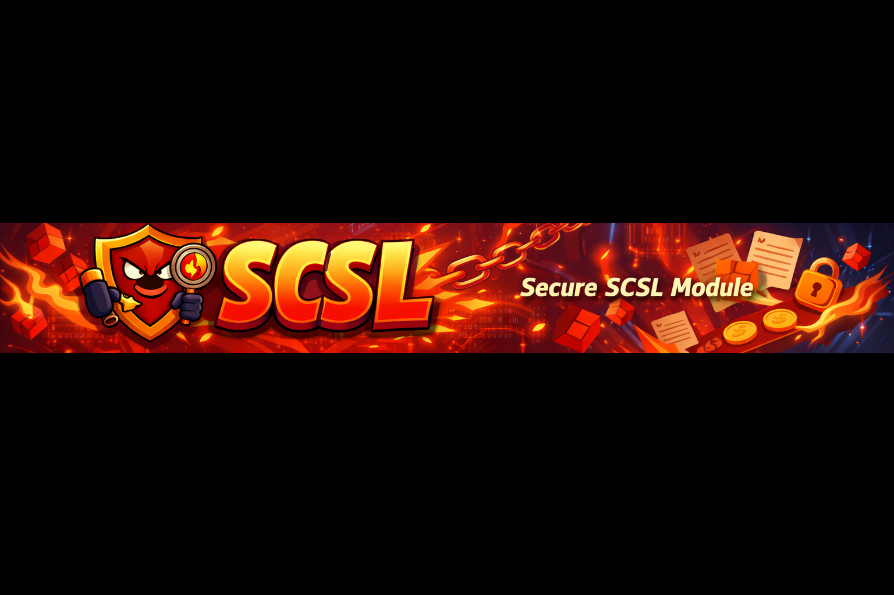

<p align="center">
  
</p>

# ACCESS CONTROL: Full Educational Module on Broken Authorization in Solidity

## Introduction

Access control is one of the most fundamental security concepts in smart-contract engineering. Whenever a contract lets one account perform actions that other accounts cannot perform, it is implementing access control. That may sound simple, but in practice access control is where many of the worst Solidity failures begin. If a contract incorrectly decides who is allowed to call a privileged function, the result can be catastrophic: ownership takeover, unauthorized upgrades, arbitrary minting, treasury drains, paused systems that can never be resumed, or administrative powers falling into the wrong hands forever.

This module focuses on a specific and very dangerous access-control anti-pattern: using `tx.origin` for authorization. It is a classic mistake because it feels intuitive to beginners. They think: “I want to check the wallet that started the transaction, so `tx.origin` must be the right value.” In reality, that choice opens the door to phishing-style attacks. A privileged user can be tricked into calling a malicious contract, and the malicious contract can then call the target contract while `tx.origin` still points to the original privileged EOA.

This module is designed as a production-style educational resource, not a toy snippet. It includes:

- a vulnerable treasury contract;
- an exploit contract that demonstrates a realistic phishing-based drain;
- a fixed treasury that uses `msg.sender` and two-step ownership transfer;
- tests that prove the exploit and the mitigation;
- detailed explanations of why the bug exists and how to avoid it.

The goal is not only to teach what the vulnerability is, but to build the right security mindset: authorization must be explicit, minimal, and based on the correct execution context.

## What Access Control Means in Solidity

In Solidity, access control determines who is allowed to do what. Common privileged actions include:

- changing ownership;
- minting or burning tokens;
- withdrawing treasury funds;
- upgrading implementations in proxy systems;
- updating risk parameters in lending protocols;
- pausing or unpausing emergency controls;
- assigning roles such as admin, operator, guardian, or strategist.

If these actions are exposed incorrectly, the contract may become permanently unsafe.

The most important mental model is this: **authorization is not business logic decoration; it is a security boundary**. If that boundary is weak, every other part of the system becomes unreliable. A perfectly written treasury is still insecure if anyone can call its privileged drain function. A carefully optimized token is still insecure if minting is protected by the wrong check.

## `msg.sender` vs `tx.origin`

This module revolves around the difference between two EVM values:

- `msg.sender`: the immediate caller of the current function;
- `tx.origin`: the original EOA that started the transaction.

This difference is critical.

Consider this call chain:

1. Owner EOA calls `MaliciousContract.claimReward()`
2. `MaliciousContract` calls `Treasury.sweepTo(attacker)`

Inside `Treasury.sweepTo()`:

- `msg.sender` is `MaliciousContract`
- `tx.origin` is the owner EOA

If the treasury checks `tx.origin == owner`, the call passes.
If the treasury checks `msg.sender == owner`, the call fails.

That is why `tx.origin` should not be used for authorization.

## Why `tx.origin` Is Dangerous

Using `tx.origin` for access control creates an implicit trust chain across contracts. It means the target contract is not verifying who is actually calling it right now. Instead, it verifies who started the transaction at the very top.

That sounds subtle, but the consequences are severe:

- any intermediary contract can piggyback on the owner’s transaction;
- phishing becomes possible because the victim only needs to click one misleading button;
- authorization leaks across call boundaries;
- the target contract loses the ability to distinguish direct admin actions from malicious forwarded actions.

In other words, `tx.origin` makes the authorization model depend on user behavior outside the contract. That is not a stable security boundary.

## The Vulnerable Contract: `OriginBasedTreasury`

The vulnerable contract in this module is a treasury. It accepts Ether deposits and allows the owner to sweep the entire treasury balance to a recipient. That is a realistic privileged operation. Many real systems include some version of emergency withdraw, rescue funds, fee collection, or treasury migration.

The vulnerable logic looks like this:

```solidity
require(tx.origin == owner, "Unauthorized origin");
```

This is the bug. The contract should verify the direct caller, but instead it verifies the transaction originator.

If the owner calls a malicious contract, that malicious contract can call the treasury on the owner’s behalf. Because `tx.origin` remains the owner’s EOA throughout the full transaction, the treasury will accept the call even though the immediate caller is malicious.

## Step-by-Step Attack Walkthrough

The test suite models a realistic scenario:

- the owner funds the treasury with 3 ETH;
- Alice deposits 4 ETH;
- Bob deposits 5 ETH;
- the treasury now holds 12 ETH;
- the attacker deploys a phishing contract.

Now the exploit unfolds:

1. The attacker convinces the owner to call `claimReward()` on the attacker contract.
2. The owner believes they are claiming a harmless reward or interacting with a trusted dApp.
3. Inside `claimReward()`, the malicious contract silently calls `target.sweepTo(address(this))`.
4. The treasury checks `tx.origin == owner`.
5. Because the original transaction really was started by the owner EOA, the check passes.
6. The treasury transfers its full Ether balance to the attacker contract.
7. The attacker later calls `withdrawLoot()` and forwards the stolen Ether to their own address.

The most important point is this: the owner never called the treasury directly. The attacker contract did. The exploit works only because the treasury authenticated the wrong thing.

## EVM-Level Execution Flow

To understand why this works so reliably, it helps to think in terms of call frames.

Frame 1:

- `owner EOA -> TxOriginPhishingAttacker.claimReward()`

At this moment:

- `msg.sender == owner`
- `tx.origin == owner`

Frame 2:

- `TxOriginPhishingAttacker -> OriginBasedTreasury.sweepTo(attacker)`

Now inside the treasury:

- `msg.sender == attackerContract`
- `tx.origin == owner`

The contract must use `msg.sender` here if it wants to know who is actually making the call. But because it uses `tx.origin`, it treats the malicious forwarder as implicitly trusted.

This is the heart of the vulnerability.

## Line-by-Line Analysis of `Vulnerable.sol`

### `address public owner;`

This stores the privileged address. That part is fine by itself. A single-owner treasury is not inherently unsafe if the authorization checks are correct.

### `constructor(address initialOwner)`

The constructor sets the treasury owner when the contract is deployed. Again, that is standard and safe.

### `deposit()`

This function lets anyone fund the treasury:

- it rejects zero-value deposits;
- it emits an event;
- it does not apply any special authorization because deposits are not privileged.

This is realistic. Many contracts accept funds from multiple actors but restrict how those funds can later be moved.

### `sweepTo(address recipient)`

This is the critical function:

```solidity
require(tx.origin == owner, "Unauthorized origin");
```

Why this is wrong:

- it authenticates the wrong EVM context value;
- it trusts the top-level originator rather than the direct caller;
- it allows malicious forwarding contracts to exercise owner privileges.

Everything else in the function may look correct:

- recipient validation;
- non-empty treasury check;
- low-level Ether transfer;
- event emission.

But if the authorization check is wrong, the whole function is compromised.

## Line-by-Line Analysis of `Attack.sol`

### `claimReward()`

This is the phishing entry point. The malicious contract does not need to look dangerous. In real life it might pretend to be:

- a rewards claim page;
- a wallet verification tool;
- a migration helper;
- a governance voting portal;
- an NFT mint with a hidden side effect.

The important detail is that the owner initiates the transaction willingly. That is enough for `tx.origin` to become weaponized.

### `target.sweepTo(address(this))`

This is where the exploit happens. The attacker contract directly invokes the treasury’s privileged function. If authorization is based on `msg.sender`, the call fails immediately. If authorization is based on `tx.origin`, the call succeeds because the owner started the transaction.

### `withdrawLoot()`

This function is operational cleanup. Once the attacker contract has stolen the Ether, it forwards the balance to the attacker operator.

## The Fixed Contract: `RoleBasedTreasury`

The secure version addresses the vulnerability in two ways.

### 1. Proper Authorization with `msg.sender`

The core fix is the `onlyOwner` modifier:

```solidity
require(msg.sender == owner, "Only owner");
```

This ensures that the direct caller is the owner. A malicious intermediary contract can no longer borrow the owner’s authority.

### 2. Two-Step Ownership Transfer

The fixed contract also uses:

- `transferOwnership(newOwner)`
- `acceptOwnership()`

This is an important production-oriented improvement. Single-step ownership transfer is easy to misuse:

- the owner may set the wrong address;
- the new owner may not control the address they were given;
- a typo can permanently lock administration.

Two-step transfer reduces the chance of operational mistakes. The current owner proposes a new owner, and the new owner must explicitly accept the role.

## Why the Fixed Version Stops the Attack

In the phishing scenario, the owner still calls the attacker contract first. But when the attacker contract forwards the call into `RoleBasedTreasury`, the treasury sees:

- `msg.sender == attackerContract`
- `owner == realOwnerEOA`

The check fails:

```solidity
require(msg.sender == owner, "Only owner");
```

That means the treasury correctly rejects the forwarded call even though the owner started the top-level transaction.

This is exactly the behavior we want. A privileged function must only be executable by the trusted direct caller, not by arbitrary intermediaries.

## Real-World Access Control Failures

Access-control bugs have caused some of the biggest losses in smart-contract history. One important historical example is the Parity multisig wallet incidents. In one of the major Parity failures, initialization and ownership logic were mishandled in a way that exposed privileged functionality. The consequence was devastating because administrative power in a wallet or treasury system is effectively absolute.

Why this matters for this module:

- access control is not “just one more check”;
- once admin power is compromised, the attacker usually gains full system leverage;
- treasury contracts are especially sensitive because privileged calls often move all funds at once.

Even when the specific bug differs from `tx.origin`, the broader lesson is the same: broken authorization collapses every other guarantee in the system.

## Remediation Strategies

### Use `msg.sender` for Authorization

This is the direct fix for the vulnerability demonstrated here. Admin checks should almost always be based on the immediate caller.

### Use Modifiers or Centralized Permission Logic

Instead of writing authorization conditions ad hoc across many functions, centralize them:

- `onlyOwner`
- `onlyRole`
- `onlyGuardian`
- `onlyOperator`

This improves readability and reduces the chance of inconsistent checks.

### Use Least Privilege

Do not give a single role more authority than necessary. Split responsibilities when practical:

- owner for governance;
- guardian for emergency pause;
- operator for routine execution;
- treasurer for fund movement.

Smaller permissions reduce blast radius.

### Prefer Two-Step Ownership Transfer

Administrative mistakes are common. Two-step transfer prevents accidental lockout and misconfigured owner handoff.

### Emit Events for Privileged Actions

Event logs do not stop an attack, but they improve monitoring, incident response, and auditability. Every critical administrative action should be traceable.

## Best Practices

- Never use `tx.origin` for authorization.
- Prefer `msg.sender` and well-audited access-control patterns.
- Keep privileged functions minimal and explicit.
- Use two-step ownership transfer for operational safety.
- Separate governance privileges from routine execution privileges.
- Add tests for unauthorized callers, malicious intermediary contracts, and successful legitimate admin flows.
- Review every function that can move funds, change roles, pause the system, or upgrade implementations.
- Assume users can be phished and design authorization so phishing cannot silently borrow privileges across contracts.

## Common Developer Mistakes

### Mistake 1: “I want to know the real wallet, so I should use `tx.origin`”

This is the most direct mistake in this module. The “real wallet” is not the same thing as the “authorized caller.” For access control, the correct question is usually: who is directly calling this contract right now?

### Mistake 2: “The owner would never call a malicious contract”

Security design should never depend on perfect user behavior. Users click links, approve transactions, interact with aggregators, use browser wallets, and get socially engineered. Good contract design assumes mistakes will happen.

### Mistake 3: “The rest of the function is safe, so authorization is probably fine”

A function can have perfect value checks, transfer logic, and event logging, but if the authorization condition is wrong, the function is still critically vulnerable.

### Mistake 4: “Access control only matters for ownership transfer”

No. It matters for any privileged workflow:

- fund movement;
- fee collection;
- pausing;
- rescue functions;
- upgradeability;
- minting and burning;
- configuration changes.

### Mistake 5: “One positive admin test is enough”

It is not enough to prove that the owner can call a function. You also need to prove:

- unauthorized EOAs cannot call it;
- malicious contracts cannot call it;
- phishing-style forwarding paths fail;
- legitimate admin actions still work after the fix.

## How to Read the Tests in This Module

The attack test demonstrates a realistic drain:

- multiple honest users fund the treasury;
- the attacker deploys a phishing contract;
- the owner is tricked into calling the attacker;
- the treasury is drained into the attacker contract;
- the operator cashes out afterward.

The fix test proves two independent properties:

- the phishing-based `tx.origin` attack fails;
- real administrative actions still work through direct owner calls and two-step ownership transfer.

This is a very important security engineering pattern: a good fix must preserve legitimate functionality, not just stop the exploit.

## Why This Module Feels Like a Real Audit Case

Many beginner tutorials explain access control too vaguely:

- they say “just use `onlyOwner`” without explaining why;
- they do not model attacker-controlled intermediary contracts;
- they do not show realistic treasury flows;
- they do not test operational admin behavior after the fix.

Real audits are different. Auditors ask:

- what is the exact security boundary?
- what execution context is being authenticated?
- can authorization be borrowed across call chains?
- can social engineering turn a privileged user into an involuntary forwarder?
- does the fix still support the real operational workflow?

This module is built around those questions.

## Conclusion

Broken access control is one of the highest-severity classes of vulnerabilities in Solidity because it attacks the system’s authority model directly. If a contract cannot reliably answer “who is allowed to do this?”, then every protected action becomes suspect.

The specific lesson of this module is simple and extremely important:

- `msg.sender` identifies the direct caller;
- `tx.origin` identifies the original EOA;
- authorization should almost never depend on `tx.origin`.

If you train yourself to ask, “Am I authenticating the immediate caller or the original transaction originator, and which one actually matters for this security boundary?”, you are thinking like a smart-contract security engineer. That mindset is exactly what this lab is meant to develop.
